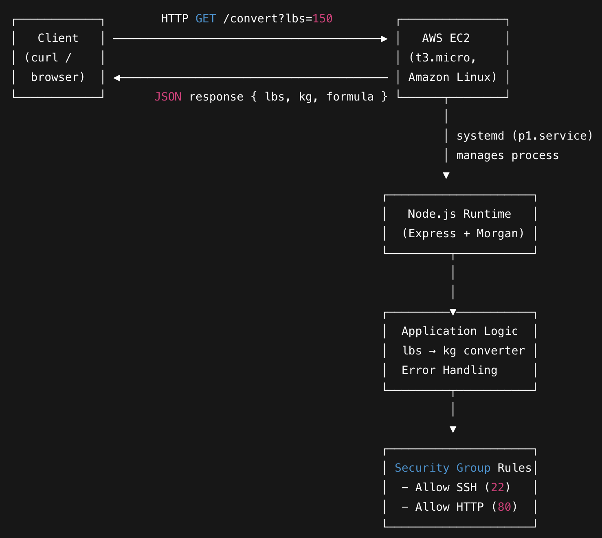

## EC2 Provisioning
- **Instance Type:** t3.micro (Free Tier).  
- **Operating System:** Amazon Linux 2023.  
- **Key Pair:** Generated a `.pem` file for secure SSH login.  
- **Security Group Configuration:**  
  - **Port 22 (SSH):** Enabled for remote access.  
  - **Port 80 (HTTP):** Enabled to allow API requests from clients.  
- This forms the infrastructure layer (EC2 + Security Group) in the architecture.

## Connect & Install Runtime
- Connected to the EC2 instance with the PEM key:  
  ```bash
  ssh -i projectkey.pem ec2-user@<PUBLIC_IP>

## System Design Diagram



## System flow

1. **Client** sends `GET /convert?lbs=<value>` via curl or browser.  
2. **Security Group** allows the request on port 80 into the **EC2 instance**.  
3. **systemd** ensures the **Node.js/Express service** is running.  
4. **Express.js app** validates the `lbs` parameter:  
   - Missing/invalid → **400 Bad Request**  
   - Negative/non-finite → **422 Unprocessable Entity**  
   - Valid → convert lbs → kg  
5. **Response** returned as JSON:  
   ```json
   { "lbs": 150, "kg": 68.039, "formula": "kg = lbs * 0.45359237" }