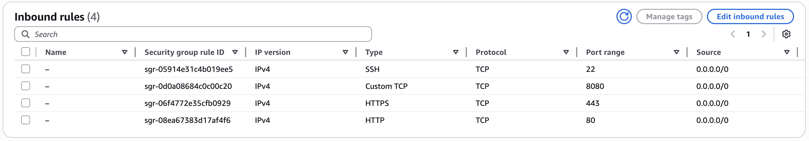

# CS 554 Project 1 (Pounds to Kilograms Converter (AWS EC2))

## Overview
This project implements a simple RESTful web service that converts pounds (lbs) to kilograms (kg).  
It is deployed on AWS EC2 using Node.js, Express.

## Public End Point:
curl 'http://18.219.89.56:8080/convert?lbs=150'

## Security Group Configuration:


## Run:
URL: http://18.219.89.56:8080/convert
Method: GET
Parameter: lbs (number)

## Test:
node server.js

# In new terminal 
curl 'http://18.219.89.56:8080/convert?lbs=150'

## Test cases

you can find test cases and error cases screen shot in the screenshot.pdf

### Error Responses

| Status Code             | Scenario              | Example Command              |
|--------------------------|-----------------------|------------------------------|
| **400 Bad Request**      | Missing parameter     | GET /convert                 |
| **400 Bad Request**      | Invalid number        | GET /convert?lbs=NaN         |
| **422 Unprocessable Entity** | Negative value   | GET /convert?lbs=-5          |

## Technology Stack

- **Runtime:** Node.js 18+  
- **Framework:** Express.js 4.18+  
- **Logging:** Morgan middleware  
- **Process Management:** systemd  
- **Cloud Platform:** AWS EC2 (t3.micro)  
- **Operating System:** Amazon Linux 2023  
- **Cost:** $0 (Free tier)

## Screenshots 

The following are included in screenshots.pdf:
Curl success responses
Curl error responses
systemctl status output
Security group configuration

## Cleanup Instructions

To avoid unnecessary charges after completing the project:

1. **Stop and Terminate EC2 Instance**
   - Go to the AWS Management Console → EC2 → Instances.
   - Select your instance and click **Terminate**.

2. **Delete Associated EBS Volumes**
   - When terminating, ensure attached storage (volumes) is deleted.
   - Check **Volumes** in EC2 console and manually delete if needed.

3. **Remove Security Group**
   - Go to EC2 → Security Groups.
   - Delete the group created for this project.

4. **Delete PEM Key Pair**
   - Go to EC2 → Key Pairs.
   - Delete the key pair you downloaded for SSH access.

5. **Clear Local Files**
   - Remove the `.pem` key from your local machine:
     ```bash
     rm ~/Downloads/projectkey.pem
     ```

6. **Double-Check Billing**
   - Log in to the AWS billing dashboard and confirm that no active services are running.
